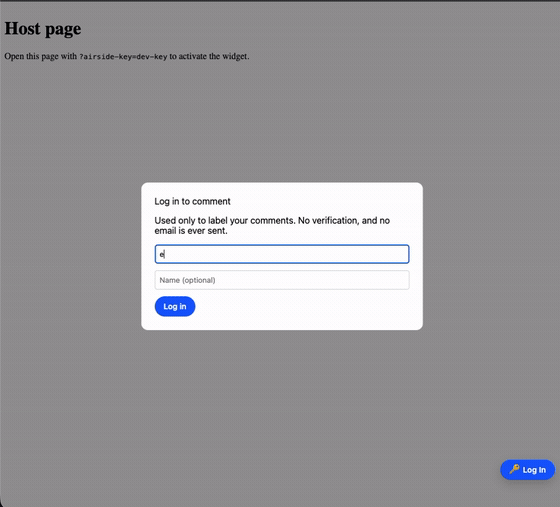

<p align="center">
  <picture>
    <source media="(prefers-color-scheme: dark)" srcset="assets/airside-logo-dark.svg">
    
  </picture>
  <h1 align="center">
Embeddable Commenting Tool
</h1>
</p>

A self-contained, open-source commenting overlay you host yourself. Drop the widget into any web page — Next.js, plain HTML, or anything in between — and reviewers can leave threaded, DOM-anchored comments without touching your page design or sending data to a third-party service.

- **Client-side:** a light-DOM widget with its own bundled React; no iframe, no Shadow DOM.
- **Server-side:** a Web-standard `Request → Response` handler you mount inside your own app.
- **Database:** MongoDB Atlas or PostgreSQL — you choose; the driver only enters builds that import the matching adapter.
- **Storage:** Vercel Blob or local filesystem for image attachments.

<p align="center">
  
</p>

---

## Quick start (Next.js App Router)

### 1. Install

```bash
pnpm add @airnauts/airside-integration-next @airnauts/airside-client \
  @airnauts/airside-adapter-mongo @airnauts/airside-storage-vercel-blob
# React is required in your Next.js app already; no extra peer to install.
```

### 2. Mount the API route

Create `app/api/airside/[...path]/route.ts`:

```ts
import { createAirsideAppRoute } from '@airnauts/airside-integration-next'
import { mongoRepository } from '@airnauts/airside-adapter-mongo'
import { createVercelBlobStorage } from '@airnauts/airside-storage-vercel-blob'

export const { GET, POST, PATCH, DELETE, OPTIONS } = createAirsideAppRoute({
  secretKey: process.env.AIRSIDE_SECRET!,
  projectId: 'my-app',
  allowedOrigins: ['https://my-app.example.com'],
  repository: mongoRepository({ uri: process.env.MONGODB_URI! }),
  storage: createVercelBlobStorage({ token: process.env.BLOB_READ_WRITE_TOKEN! }),
})
```

### 3. Mount the widget

In your root layout:

```tsx
'use client'
import { AirsideLayer } from '@airnauts/airside-integration-next/client'

export function AirsideMount() {
  return <AirsideLayer airsideKey={process.env.NEXT_PUBLIC_AIRSIDE_KEY!} endpoint="/api/airside" />
}
```

The widget is inert until a page is opened with `?airside-key=<your-secret-key>` in the URL. After that, the key is persisted to `localStorage` so it stays active on subsequent visits.

### Local development (no database)

Swap in the in-memory adapter:

```ts
import { createMemoryRepository } from '@airnauts/airside-adapter-memory'
import { createFileSystemStorage } from '@airnauts/airside-storage-fs'

export const { GET, POST, PATCH, DELETE, OPTIONS } = createAirsideAppRoute({
  secretKey: 'dev-key',
  projectId: 'my-app',
  allowedOrigins: ['http://localhost:3000'],
  repository: createMemoryRepository(),
  storage: createFileSystemStorage({ rootDir: './public/uploads', baseUrl: '/uploads' }),
  rateLimit: false,
})
```

---

## Alternative setups

The Quick start wires both halves on the Next.js App Router. Each half swaps
independently — pick **one server mount** and **one widget mount**:

- **Server** — App Router (above), Pages Router (below), or, on any other host, the
  Web-standard `server.handle(request)` directly: a Fetch-native framework like Hono
  passes its `Request` straight in; a classic Node host (Express, `http`) bridges
  `req`/`res` via `@airnauts/airside-server/node`. Node-compatible runtimes only
  (the server uses `node:crypto`, `Buffer`, and Node database drivers).
- **Widget** — `AirsideLayer` for React (below), or `airside.init()` for vanilla
  JS (below).

The widget only needs an `endpoint` pointing at a mounted server; the server only needs
the widget's origin in its `allowedOrigins`.

### Server — Next.js Pages Router

On the Pages Router, mount a catch-all API route with `createAirsidePagesRoute`:

```ts
// pages/api/airside/[...path].ts
import { createAirsidePagesRoute } from '@airnauts/airside-integration-next'
import { createMemoryRepository } from '@airnauts/airside-adapter-memory'

// REQUIRED: Next reads this statically, so the helper can't set it. The comments
// API parses JSON/multipart itself, so the raw body must reach it unparsed.
export const config = { api: { bodyParser: false } }

export default createAirsidePagesRoute({
  secretKey: process.env.AIRSIDE_SECRET ?? 'dev-key',
  projectId: 'my-app',
  allowedOrigins: ['http://localhost:3000'],
  repository: createMemoryRepository(),
  storage: { async put(blob) { return { url: `mem://${blob.name}`, key: blob.name, size: 0 } } },
  rateLimit: false,
})
```

A single default export handles every method — `server.handle` answers the CORS
preflight (`OPTIONS`) internally. Keep this on the **Node runtime** (the default):
the server uses `node:crypto`, `Buffer`, and Node-only database drivers, so it
cannot run on the Edge runtime. For production, swap `createMemoryRepository()` and the
storage stub for `mongoRepository({ uri })` + `createVercelBlobStorage({ token })` (or
`createFileSystemStorage`), exactly as in the App Router Quick start.

### Widget — React (any framework)

`AirsideLayer` is a plain React component — it works in any React app (Vite, CRA,
Remix…), not just Next.js. Install the React integration package:

```bash
pnpm add @airnauts/airside-integration-react
```

Render it once near your app root and point `endpoint` at the
mounted server (use an absolute URL when the API is on another origin, and add that origin
to the server's `allowedOrigins`):

```tsx
import { AirsideLayer } from '@airnauts/airside-integration-react'

export function App() {
  return (
    <>
      {/* your app */}
      <AirsideLayer
        airsideKey={import.meta.env.VITE_AIRSIDE_KEY}
        endpoint="https://api.example.com/api/airside"
      />
    </>
  )
}
```

`@airnauts/airside-integration-react` needs `react` as a peer — already present in your React
app, so there's nothing extra to install beyond the package above.

### Widget — Vanilla JS (no framework)

Without React, call `airside.init()` directly. It returns a handle you can `destroy()` to
tear the widget down again:

```ts
import { airside } from '@airnauts/airside-client'

const handle = await airside.init({
  key: 'your-secret-key',
  endpoint: '/api/airside', // or an absolute URL to a server on another origin
})

// later, to remove the widget:
// handle.destroy()
```

As with the React wrapper, the widget stays inert until the page is opened with
`?airside-key=<key>` (after which the key is persisted and the param stripped from the
URL). Use it from any bundler, or from a `<script type="module">` on a plain HTML page.

---

## Packages

This is a pnpm monorepo. All packages under `packages/*` are published to npm under the `@airnauts` scope.

| Package | Description |
|---|---|
| [`@airnauts/airside-core`](packages/core) | Isomorphic: Zod schemas, HTTP contract types, `pageKey` normalization, anchor scoring/threshold policy, OpenAPI generator |
| [`@airnauts/airside-client`](packages/client) | Widget engine (`init()`), light-DOM anchoring runtime |
| [`@airnauts/airside-integration-react`](packages/integration-react) | React host wrapper (`AirsideLayer`) — calls `init()` in an effect |
| [`@airnauts/airside-server`](packages/server) | Web-standard HTTP handler, use cases, CORS/security, adapter interfaces, generic Node bridge, dev server |
| [`@airnauts/airside-integration-next`](packages/next) | One-call Next.js App and Pages Router integration (`createAirsideAppRoute` / `createAirsidePagesRoute`) |
| [`@airnauts/airside-adapter-mongo`](packages/adapter-mongo) | MongoDB Atlas / self-hosted repository adapter |
| [`@airnauts/airside-adapter-postgres`](packages/adapter-postgres) | PostgreSQL repository adapter (hybrid columns + `jsonb`; driver-agnostic) |
| [`@airnauts/airside-adapter-memory`](packages/adapter-memory) | In-memory repository for local development and tests |
| [`@airnauts/airside-storage-vercel-blob`](packages/storage-vercel-blob) | Vercel Blob image-attachment storage |
| [`@airnauts/airside-storage-s3`](packages/storage-s3) | Amazon S3 / Cloudflare R2 image-attachment storage |
| [`@airnauts/airside-storage-fs`](packages/storage-fs) | Filesystem image-attachment storage |
| [`@airnauts/airside-extension-slack`](packages/notifier-slack) | Slack Incoming Webhook notification extension |
| [`@airnauts/airside-extension-email`](packages/notifier-email) | Email notification extension (SMTP via nodemailer or Resend HTTP API) |
| [`@airnauts/airside-extension-jira`](packages/integration-jira) | "Create Jira issue" thread-action extension for Jira Cloud |

---

## Examples

| Example | Description |
|---|---|
| [`examples/nextjs-host`](examples/nextjs-host) | Full Next.js App Router integration — MongoDB, Vercel Blob, Slack notifications, Jira integration, Playwright e2e tests |
| [`examples/playground`](examples/playground) | Minimal Vite + in-memory server sandbox for widget development |

---

## Roadmap

None of these are committed releases — they're the directions we're considering. Every parking-lot item and known rough edge is tracked, with its full rationale, in [GitHub issues](https://github.com/Airnauts/airside/issues) (`enhancement` for features, `bug` for rough edges in shipped behavior).

**Widget & UX**

- Per-comment overflow menu — edit / delete / copy a comment _(needs new `PATCH`/`DELETE` comment endpoints)_.
- Emoji reactions on comments _(new `Comment` field + add/remove-reaction endpoints across both adapters)_.
- Smooth, document-anchored pin positioning — drop the per-scroll-frame layout work for jank-free pins _(parking lot; a positioning-basis change that would get its own ADR)_.
- Hide-all-pins toggle — temporarily hide the marker overlay while keeping the session active _(parking lot)_.
- "Powered by Airside" logo mark in the widget chrome with a link back to the repo _(parking lot; host-configurable)_.
- In-widget changelog popup surfacing recent user-facing changes to reviewers _(parking lot)_.
- Page-level / unanchored comments — start a thread without placing a pin, for general page feedback _(parking lot; schema seam already designed in the architecture)_.
- Rich-text / Markdown comment bodies.
- `@mentions` and thread assignment.
- Accessibility & keyboard-navigation pass; widget UI localization (i18n).

**Real-time & collaboration**

- Live updates — push new comments and threads to open widgets (SSE or WebSocket) instead of refetch-on-focus.
- Authenticated reviewer identity — map commenters to real user accounts / SSO instead of a typed-in name.

**Integrations & extensions**

- Jira comment sync — mirror later thread replies into a linked Jira issue _(parking lot; needs `externalLinks` on the notification event)_.
- More thread-action integrations — Linear, GitHub Issues.
- More notifiers — Discord, Microsoft Teams, generic outbound webhook.

**Adapters & hosts**

- More persistence adapters — SQLite, MySQL.
- More host-framework glue beyond Next.js — Remix, SvelteKit, Astro, and a generic `Request`-based handler for Hono / Express.

**Managed cloud**

- Hosted cloud version — a subscription-based, fully-managed offering for teams that want the review workflow without standing up their own server: we run the comment server, database, and attachment storage; you drop in the widget. Self-hosting the open-source packages stays free and first-class.

**Bug fixes & known rough edges**

- Opening a thread does not surface its anchored text selection visually _(missing behavior)_.
- Thread page-context card shows the URL on both lines because `pageTitle` is never captured at create time _(cosmetic; fix is a one-liner in the client)_.
- Cross-element text selections (spanning a tag boundary) anchor to a signal-less parent and are easily lost on re-render _(correctness bug; pairs with the two issues below)_.
- A pin on a plain structural element can silently migrate to the wrong surviving sibling after the original is removed _(correctness bug; TDD fix deferred)_.
- Signal-less elements (no `id`, class, or `data-*` attribute) cannot clear the re-anchor score threshold under structural mutations and always orphan _(known v1 scoring limitation)_.
- MongoDB adapter emits a cosmetic webpack `aws4` warning when bundled by Next.js — build succeeds and runtime is unaffected _(deferred; fix is a lazy-import change in the adapter)_.

> Want one of these sooner, or have a use case we haven't listed? Open an issue or reach out to [Airnauts](https://www.airnauts.com/).

---

## Developing in this monorepo

**Prerequisites:** Node.js ≥ 18, [pnpm](https://pnpm.io/) ≥ 9.

```bash
# Install all dependencies
pnpm install

# Build all packages (required before running examples or tests)
pnpm build

# Run all tests
pnpm test

# Typecheck all packages
pnpm typecheck
```

**Branching:** development happens directly on `main` until the beta release.

**Releases** are managed by [Changesets](https://github.com/changesets/changesets). Publishing is automatic on every push to `main` (after CI passes). See [`RELEASING.md`](RELEASING.md) for the full release procedure.

---

## License

MIT

---

## About Airnauts

<p align="center">
  <a href="https://www.airnauts.com/">
    <picture>
      <source media="(prefers-color-scheme: dark)" srcset="assets/airnauts-logo-dark.svg">
      
    </picture>
  </a>
</p>

This tool is built and maintained by [Airnauts](https://www.airnauts.com/) — a digital product studio that designs and engineers web and mobile products end to end, from early concept and UX through to production software.

We built Airside to solve a recurring problem in our own client work: gathering precise, in-context feedback on live web pages without bolting on a heavyweight third-party SaaS. We open-sourced it so other teams can host the same review workflow on their own infrastructure, keep their data in their own database, and adapt the widget to their own product.

If you'd like help integrating it, or you're looking for a partner to design and build your next product, get in touch at [airnauts.com](https://www.airnauts.com/).
